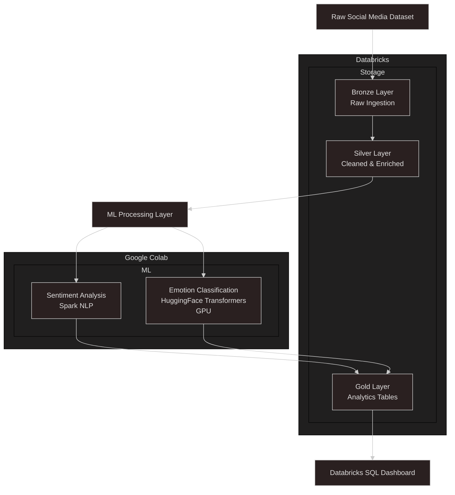

```mermaid
---
config:
  theme: neo-dark
  layout: dagre
---
flowchart TB
 subgraph Storage["Storage"]
        B["Bronze Layer<br>Raw Ingestion"]
        C["Silver Layer<br>Cleaned &amp; Enriched"]
        E["Gold Layer<br>Analytics Tables"]
  end
 subgraph Databricks["Databricks"]
        Storage
  end
 subgraph ML["ML"]
        D1["Sentiment Analysis<br>Spark NLP"]
        D2["Emotion Classification<br>HuggingFace Transformers<br>GPU"]
  end
 subgraph s1["Google Colab"]
        ML
  end
    A["Raw Social Media Dataset"] --> B
    B --> C
    C --> D["ML Processing Layer"]
    D --> D1 & D2
    D1 --> E
    D2 --> E
    E --> F["Databricks SQL Dashboard"]
```