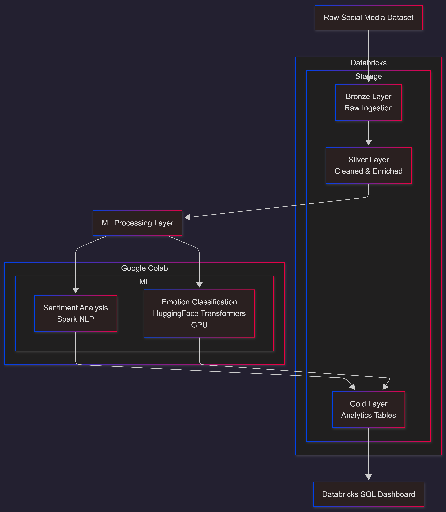

# 📊 Social Media Sentiment Analysis Platform  
**End-to-End Data Engineering & ML Pipeline**

## 📌 Table of Contents
- [Overview](#overview)
- [Architecture](#architecture-overview)
- [Tech Stack](#tech-stack)
- [Repository Structure](#repository-structure)
- [Prerequisites](#prerequisites-mandatory)
- [Execution Flow](#execution-flow)
- [Dashboards](#dashboards)
- [Future Enhancements](#future-enhancements)

---

## 🔍 Overview

This project implements an **end-to-end sentiment analytics platform** for social media data using **Apache Spark, NLP, and ML models**, following an **industry-grade medallion architecture**.

The pipeline ingests raw data, performs scalable transformations, applies **sentiment and emotion analysis**, and exposes **business-ready insights** through interactive dashboards.

---

## 🏗️ Architecture



**High-level flow:**

```

Raw → Bronze → Silver → ML → Gold → Dashboard


```

---

## 🧱 Medallion Architecture

### 🥉 Bronze Layer – Raw Ingestion
- Stores raw social media data
- Enforced schema, no transformations
- Mirrors source structure

**Purpose:** Traceability & replayability

---

### 🥈 Silver Layer – Cleaned & Enriched
- Deduplication
- Language filtering (English)
- Timestamp normalization
- Text cleaning
- Feature engineering:
  - Word count
  - Hashtag / mention flags

**Purpose:** Analytics & ML-ready dataset

---

### 🤖 ML Processing Layer

ML inference is **decoupled from Spark ETL**, following industry best practices.

#### Sentiment Analysis
- Spark NLP
- Scalable batch inference

#### Emotion Classification
- HuggingFace Transformers
- GPU-accelerated (T4)
- Batched inference for efficiency

**Outputs:**
- `sentiment_label`
- `emotion_label`

---

### 🥇 Gold Layer – Analytics

Business-ready aggregated tables:
- Monthy Tweet Counts
- Daily sentiment trends
- Daily emotion trends
- Overall sentiment distribution
- Overall emotion distribution
- Net sentiment score
- Trending Hashtags

Optimized for dashboard performance.

---

## 📊 Dashboard (Databricks SQL)

**Key Insights:**
- Daily sentiment trend (positive vs negative)
- Emotion distribution
- Net sentiment KPI
- Overall sentiment & emotion share

**Design Principles:**
- KPIs separated from trends
- Time-series optimized aggregations
- Business-readable visuals

---

## ⚙️ Tech Stack

|     Category    |       Technology         |
|-----------------|--------------------------|
|    Processing   |       Apache Spark       |
|     Storage     |   Parquet / Delta Lake   |
|    Sentiment    |        Spark NLP         |
|     Emotion     | HuggingFace Transformers |
| ML Acceleration |       NVIDIA T4 GPU      |
|    Analytics    |      Databricks SQL      |
|  Visualization  |   Databricks Dashboards  |

---

## 🚀 Performance Highlights

- GPU inference reduced batch runtime from **minutes to seconds**
- Batched ML inference maximized GPU utilization
- Optimized Gold tables for fast dashboard queries

---

## 🧠 Key Design Decisions

- Medallion architecture for data quality
- Batch ML inference instead of row-level Spark UDFs
- Spark for ETL, Transformers for ML
- Materialized Gold tables for analytics

---

## 📁 Repository Structure

```
.
├── Notebooks/
│       └── Bronze
│    	       └─ bronze_notebook.ipynb
│       └── Silver
│   	       └─ silver_notebook.ipynb
│       └── Machine Learning
│   	       └─ ml_flow_notebook.ipynb
│   	       └─ mlflow_dataset_preparation_notebook.ipynb
│   	       └─ README.md
│       └── Gold
│   	       └─ gold_notebook.ipynb
│   	       └─ gold_views_notebook.ipynb
│
├── Source_Data/
│       └── README.md
│
├── Docs/
│       └── setup_prerequisites.md
│
├── Data_sample/
│       └── source_sample.csv
│       └── bronze_sample.csv
│       └── silver_sample.csv
│       └── gold_sample.csv
│       └── gold_ml_core_sample.csv
│
├── Dashboard/
│       └── Sentiment_Analysis_Dashboard.Ivdash
│       └── README.md
│
├── Visualization/
│       └── Count_of_records_by_month.png
│       └── Daily_Net_Sentiment.png
│       └── Daily_Sentiment_Trend.png
│       └── Overall_Sentiment_Distribution.png
│       └── Weekly_Emotion_Trend.png
│       └── Overall_Emotion_Distribution.png
│       └── Trending_Hashtags.png
│
├── Architecture/
│       └── architecture_diagram.md
│       └── architecture_diagram.png
│
└── LICENSE
└── CONTRIBUTING.md
└── README.md
```

---

## Prerequisites

Before running the pipelines, ensure that the required Unity Catalog,
schemas, and volumes are created.

📄 Refer to: `Docs/setup_prerequisites.md`

---

## ▶️ Execution Flow

Follow the steps below to run the project end-to-end.

---

### Step 1: Environment Setup
- Ensure Unity Catalog, schemas, and volumes are created
- Refer to: `Docs/setup_prerequisites.md`

---

### Step 2: Ingestion (Raw → Bronze)
- Upload source dataset to `raw.social_media_volume`
- Run Bronze ingestion notebook in Databricks
- Output: Bronze Delta tables

---

### Step 3: Transformation (Bronze → Silver)
- Run Silver transformation notebook
- Includes:
  - Data cleaning
  - Deduplication
  - Standardization
- Output: Silver Delta tables

---

### Step 4: ML Dataset Preparation
Two approaches are supported:
- Single Parquet (PoC)
- Partitioned Parquet batches (Preferred)

Refer to:
📄 `ml/README.md`

---

### Step 5: ML Processing (Google Colab)
- Load Parquet data from Google Drive
- Perform sentiment & emotion inference using GPU
- Write batch outputs back to Drive

---

### Step 6: Gold Table Creation
- Ingest ML outputs into Databricks
- Create Gold tables and aggregates
- Enable analytics-ready access

---

### Step 7: Dashboard
- Connect dashboard to Gold tables
- Visualize sentiment trends and insights


## 🔮 Future Enhancements

The following enhancements are planned to further improve scalability, automation, and production readiness of the platform:

---

### 1. Automated Orchestration
- Introduce Databricks Workflows or Airflow for end-to-end pipeline orchestration
- Schedule ingestion, transformation, ML inference, and Gold refresh jobs
- Add failure handling and retry mechanisms

---

### 2. Incremental & Streaming Processing
- Extend ingestion to support incremental loads using Auto Loader
- Enable near real-time sentiment analysis for streaming social media data
- Implement watermarking and late-arriving data handling

---

### 3. ML Lifecycle Management
- Integrate MLflow for:
  - Model versioning
  - Experiment tracking
  - Model performance comparison
- Add model monitoring for data drift and prediction quality

---

### 4. Scalable Inference Framework
- Migrate batch ML inference to distributed Spark NLP or Databricks Model Serving
- Support online inference APIs for real-time use cases
- Optimize GPU utilization at scale

---

### 5. Data Quality & Observability
- Add data quality checks using Delta Live Tables expectations
- Implement row-level data validation and anomaly detection
- Introduce pipeline observability and alerting

---

### 6. Governance & Security Enhancements
- Implement fine-grained access control using Unity Catalog
- Enable audit logging for sensitive datasets
- Add PII detection and masking where applicable

---

### 7. Advanced Analytics & Dashboards
- Add time-series trend analysis and sentiment forecasting
- Enable user-level and platform-level sentiment breakdowns
- Integrate Power BI or Databricks SQL dashboards

---

### 8. CI/CD & DevOps Integration
- Add GitHub Actions for notebook validation and linting
- Automate deployment across environments (Dev / Test / Prod)
- Enforce code quality gates before merges


## 🏁 Conclusion

This project demonstrates:
- Strong **data engineering fundamentals**
- Practical **ML integration at scale**
- Clean **analytics & visualization design**
- Production-style thinking

